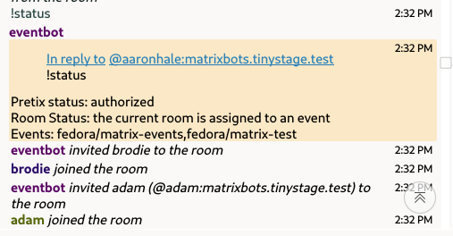

# maubot-pretix-invites

A maubot plugin that automatically invites event participants from pretix into a matrix room. This helps facilitate Fedora virtual events that are run on Matrix.

## History and project Origins

This project began with the use of pretix + Matrix combo from the F40 release party ([ticket](https://gitlab.com/fedora/commops/interns/-/issues/15)) and started a [community operations intern initiative](https://gitlab.com/fedora/commops/interns/-/issues/16) to adapt and automate the process for the Fedora Week of Diversity 2024 ([ticket](https://gitlab.com/fedora/dei/week-of-diversity/-/issues/23))

## Features
- Can auth with pretix and fetch event attendees
- Can bulk-invite attendees who havent yet been processed
- can handle incoming webhooks from pretix for paid-for events and auto-invite those people to the event room(s)
- can associate matrix rooms with events to (theoretically) invite users to multiple matrix rooms

## Basic Usage and commands

Once the bot is running and in a matrix room, you can interact with it using a few commands:

`!authorize` (no arguments) will give you an oauth url to give the bot read only access to a pretix team you are a member of.

`!authorize <callback url>` will complete the auth process in the event you dont have (or havent configured, or this bot doesnt yet support) a web server thats publicly-accessible and HTTPS-capable for receiving the callback URL to complete the authentication process. Simply use this command with the URL that you are redirected to after auth and it will do the rest.

`!batchinvite <pretix url>` this command, in combination with the pretix invitation url you probably distributed to your event participants (i.e. `https://pretix.eu/fedora/matrix-test/`) will allow the bot to query your event and grab participants matrix IDs and attempt to invite them to the room where the command was issued

`!status` check the bot's auth status and the status of the current room (is it mapped to an event)

`!setroom <pretix url>` this command, in combination with the pretix invitation url you probably distributed to your event participants (i.e. `https://pretix.eu/fedora/matrix-test/`) will associate this room with the event so the bot doesnt need the room ID to be specified when inviting people (such as through `!batchinvite` (TODO), or the webhook handler)

`!unsetroom` this command will remove this room from all events it is currently associated with

Other commands (or more up to date usage information for the above commands) is also available through the `!help` command.

### Examples
**Authorization and batch invite**

**Association and status**

**webhook auto-invites**

## How it works

## Dependencies
External things the bot needs to run well:
- (If using the webhook/automatic invite feature) a public facing web address, optionally with HTTPS.
- Access to a pretix account
- A pretix event that your pretix account can manage
- A matrix homeserver that is willing to create an account for your bot

## Basic Setup

If you would simply like to get this bot running and start using it, follow these steps. 

1. [Ensure your pretix event is set up](#setting-up-an-event)
2. Using your pretix account, [register an Oauth application](https://pretix.eu/control/settings/oauth/apps/) ([docs](https://docs.pretix.eu/en/latest/api/oauth.html#registering-an-application)) to get a pretix Client ID and Client Secret, these will be needed later.
3. Build the container from this repo with `docker build -t maubot-custom .`. This is a standard maubot container with the bot's python dependencies installed.
4. Follow the [standard maubot container setup](https://docs.mau.fi/maubot/usage/setup/docker.html) to run maubot using this new custom container image instead of the official one. Dont forget to set up the following things during the process:
    - Create yourself an admin username and password in the `config.yaml` to use for logging into the web interface
    - Tell maubot about your matrix homeserver's domain (for fedora this is likely `fedora.ems.host`)
    - If you plan to use the webhooks feature to auto-invite attendees as they register, ensure the domain you plan to use is also configured in `config.yaml`
5. Run the `./build.sh` script to build this plugin into a `.mbc` package for loading into maubot later. 
6. Login to maubot via the web interface (see maubot docs on how to do this [here](https://docs.mau.fi/maubot/usage/basic.html)).
7. Upload the `.mbc` plugin package package that you created earlier to the plugins portion of the maubot interface ([docs](https://docs.mau.fi/maubot/usage/basic.html#uploading-plugins)) 
8. Create and configure a client for your bot to use ([docs](https://docs.mau.fi/maubot/usage/basic.html#creating-clients)). This is where you will refer to the homeserver you configured earlier when setting up maubot. You will also need the [access token](https://webapps.stackexchange.com/a/138497) and device ID for your matrix account on this homeserver.
   - If a bot was created for you on the fedora homeserver by the Fedora Community Architect, you can sign in at [chat-admin.fedoraproject.org](https://chat-admin.fedoraproject.org/) with the credentials given to you so that you dont have to use the account tied to your FAS login.
   - if you forgot to put the homeserver in the config, you may also be able to specify the full URL in the homeserver box as well.
9.  Create a new instance of your bot ([docs](https://docs.mau.fi/maubot/usage/basic.html#creating-instances)), selecting your client as the "primary user" and the uploaded plugin for the "type".
10. Edit the configuration options in the box on the instance page to add your pretix secrets and the matrix IDs of the users you want to be authorized to use the bot.
    - for the redirect URL, simply enter `https://localhost:8000/` - in the future this may support reusing the same public facing web domain thats used by the incoming webhook endpoint
11. Start the bot

**If you want to use the webhooks feature of the bot**

10. Open the logs in the maubot web interface. You should see a line that starts with `Webhook URL is:`. The webhook url that follows is the domain you may have configured in step 4 with `/_matrix/maubot/plugin/<instance id>/notify` as the url. Now would be a good time to set up your proxy, or whatever else is needed to ensure that this URL is publicly accessible.
9. [Set up the webhook in pretix](#setting-up-webhooks) 

## Contributing to bot development

See [CONTRIBUTING.md](./CONTRIBUTING.md) for more details on the development workflow

## Legal and privacy information

This project may handle, and possibly store, information that could be considered "personal information" under various privacy rules such as the GDPR. While this bot tries to use as little information as possible in order to operate it is ultimately the responsibility of the event hosts and operators of this bot to ensure [that its use of information](#how-it-works) is compliant with the laws in your area.  

## Howtos

### Pretix

#### Setting up an event

Once you are in a pretix team you can set up an event. The process is pretty much the same as setting up any event in pretix, however....

If this event is being set up for testing, be sure to uncheck the "list publicly" box on the main settings page so that the event doesnt show up in your orgs public list of events

You will also need to **configure a custom question to collect participant's Matrix ID**. Pretix doesnt seem to have user facing documentation on this, so your best bet is probably to copy the settings from an existing event that had these questions already set up.

Here's what you would need to set the values to for the matrix id question (ignore the FAS one):

Currently this bot is hardcoded to look for an `internal identifier` value of `matrix`. This can be found under the advanced menu when editing the question. In the future this may be configurable.

While you are in the advanced menu, you may also want to add helptext to this question to inform event registrants that you will use this matrix ID to invite them to the event and that it must be specified in the full `@username:domain.tld` matrix username format.

#### Setting up webhooks

Webhooks are an organization-level setting that requires admin permissions to edit. Pretix has [documentation](https://docs.pretix.eu/en/latest/api/webhooks.html#configuring-webhooks) for how to configure a webhook.